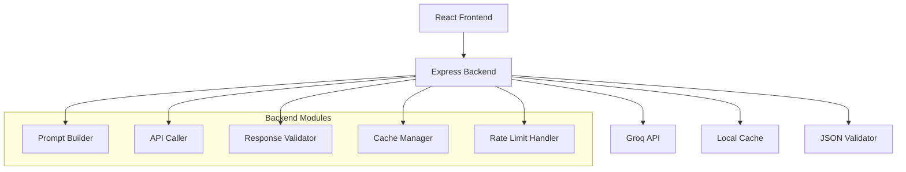

# Design Document: Trade-Off Referee

## Overview

The Trade-Off Referee is a decision-support web application built with Node.js/Express backend and React frontend. The system integrates with Groq's free-tier API to generate structured decision analysis that helps users understand trade-offs between different approaches rather than receiving single answers. The architecture emphasizes token efficiency, local caching, and robust JSON validation to work within free-tier constraints.

## Architecture

The system follows a three-tier architecture:



**Request Flow:**
1. User submits question via React frontend
2. Express backend receives request at `/compare` endpoint
3. Cache Manager checks for existing response
4. If not cached, Prompt Builder creates structured prompt
5. API Caller sends request to Groq API with rate limiting
6. Response Validator ensures JSON schema compliance
7. Cache Manager stores validated response
8. Frontend receives structured decision analysis

## Components and Interfaces

### Backend Components

#### 1. Express Server (`server.js`)
- Main application entry point
- Configures middleware (CORS, JSON parsing, rate limiting)
- Defines `/compare` endpoint
- Handles error responses and HTTP status codes

#### 2. Prompt Builder (`promptBuilder.js`)
```javascript
class PromptBuilder {
  buildPrompt(userQuestion) {
    // Returns structured prompt using Core Prompt Template
    // Replaces {{user_question}} placeholder
    // Ensures token efficiency
  }
}
```

#### 3. Groq API Caller (`groqClient.js`)
```javascript
class GroqClient {
  constructor(apiKey) {
    this.apiKey = apiKey;
    this.primaryModel = 'llama-3.3-70b-versatile';
    this.fallbackModel = 'mixtral-8x7b-instruct';
  }
  
  async callAPI(prompt, retryCount = 0) {
    // Handles API calls with fallback model
    // Implements exponential backoff for rate limits
    // Returns raw API response
  }
}
```

#### 4. Response Validator (`responseValidator.js`)
```javascript
class ResponseValidator {
  validateAndNormalize(apiResponse) {
    // Ensures all required JSON fields exist
    // Replaces missing arrays with []
    // Normalizes strings and whitespace
    // Never calls LLM again for formatting
    // Returns validated JSON matching schema
  }
}
```

#### 5. Cache Manager (`cacheManager.js`)
```javascript
class CacheManager {
  constructor(cacheFile = './cache.json') {
    this.cacheFile = cacheFile;
  }
  
  get(questionHash) {
    // Returns cached response if exists
  }
  
  set(questionHash, response) {
    // Stores validated response locally
  }
  
  generateHash(question) {
    // Creates consistent hash for question caching
  }
}
```

#### 6. Rate Limit Handler (`rateLimitHandler.js`)
```javascript
class RateLimitHandler {
  handleRateLimit(error) {
    // Processes 429 responses from Groq API
    // Extracts retry-after header
    // Implements exponential backoff
    // Returns appropriate delay time
  }
}
```

### Frontend Components

#### 1. Question Input Component
- Text area for user questions
- Submit button with loading states
- Input validation and character limits

#### 2. Decision Analysis Display Component
- Structured display of primary and alternative approaches
- Pros/cons comparison tables
- Trade-offs and recommendations sections
- Responsive design with Tailwind CSS

## Data Models

### Input Schema
```javascript
{
  question: String, // User's decision-oriented question
  required: true,
  minLength: 10,
  maxLength: 500
}
```

### Output Schema (Groq API Response)
```javascript
{
  problem_summary: String,
  primary_approach: {
    title: String,
    description: String,
    pros: Array<String>,
    cons: Array<String>,
    tradeoffs: String
  },
  alternative_approach: {
    title: String,
    description: String,
    pros: Array<String>,
    cons: Array<String>,
    tradeoffs: String
  },
  when_to_choose: {
    choose_primary_if: Array<String>,
    choose_alternative_if: Array<String>
  },
  optional_hybrid_strategy: String,
  final_recommendation: String
}
```

### Cache Entry Schema
```javascript
{
  questionHash: String,
  response: Object, // Validated output schema
  timestamp: Number,
  ttl: Number // Time to live in milliseconds
}
```

## Correctness Properties

*A property is a characteristic or behavior that should hold true across all valid executions of a system-essentially, a formal statement about what the system should do. Properties serve as the bridge between human-readable specifications and machine-verifiable correctness guarantees.*

Now I need to use the prework tool to analyze the acceptance criteria before writing the correctness properties:

Based on the prework analysis, the following properties ensure system correctness:

### Property 1: Dual Approach Generation
*For any* valid decision-oriented question, the system should generate exactly two approaches (primary and alternative) with complete structure including title, description, pros, cons, and tradeoffs.
**Validates: Requirements 1.1, 1.2**

### Property 2: JSON Schema Compliance
*For any* system response, the output should match the standardized JSON schema with all required fields (problem_summary, primary_approach, alternative_approach, when_to_choose, optional_hybrid_strategy, final_recommendation) and proper data types (arrays never null/undefined, strings normalized).
**Validates: Requirements 1.4, 4.3, 6.1, 6.2, 6.3, 6.4, 6.5**

### Property 3: Conditional Guidance Completeness
*For any* generated analysis, the when_to_choose section should contain non-empty choose_primary_if and choose_alternative_if arrays providing actionable guidance.
**Validates: Requirements 1.3**

### Property 4: Cache-First Behavior
*For any* identical question asked multiple times, the second and subsequent requests should return cached responses without making new API calls.
**Validates: Requirements 3.3, 3.4, 4.5**

### Property 5: Response Validation Without Additional API Calls
*For any* API response received, the validation and normalization process should complete without triggering additional LLM API calls.
**Validates: Requirements 2.5, 3.5**

### Property 6: Prompt Structure Consistency
*For any* user question, the generated prompt should follow the Core Prompt Template structure with proper placeholder substitution and token-efficient formatting.
**Validates: Requirements 2.1, 2.4**

### Property 7: Rate Limit Handling
*For any* 429 rate limit response from the API, the system should implement exponential backoff retry logic and attempt fallback to the secondary model.
**Validates: Requirements 2.2**

### Property 8: Model Configuration Compliance
*For any* API call, the system should use llama-3.3-70b-versatile as the primary model and mixtral-8x7b-instruct as the fallback model.
**Validates: Requirements 2.3**

### Property 9: Response Normalization
*For any* malformed API response, the validation engine should normalize missing arrays to empty arrays and handle missing fields appropriately without failing.
**Validates: Requirements 3.1, 3.2**

### Property 10: HTTP Error Handling
*For any* error condition (invalid input, API failure, validation error), the system should return appropriate HTTP status codes and error messages.
**Validates: Requirements 4.4**

### Property 11: Structural Consistency Across Domains
*For any* question from different domains (technical, business, personal), the response structure should remain consistent with the same JSON schema format.
**Validates: Requirements 5.5**

## Error Handling

The system implements comprehensive error handling at multiple levels:

### API Level Errors
- **Rate Limiting (429)**: Implement exponential backoff with retry-after header parsing
- **Authentication (401)**: Return clear error message about API key configuration
- **Service Unavailable (503)**: Attempt fallback model, then return graceful error
- **Timeout**: Implement request timeout with fallback to cached response if available

### Validation Errors
- **Invalid JSON Response**: Normalize and fix common issues without re-calling API
- **Missing Required Fields**: Add default values (empty arrays, empty strings)
- **Type Mismatches**: Convert types where possible, fail gracefully otherwise

### Application Errors
- **Invalid User Input**: Return 400 with specific validation messages
- **Cache Corruption**: Rebuild cache entry, log error for monitoring
- **File System Errors**: Handle cache file read/write failures gracefully

### Error Response Format
```javascript
{
  error: true,
  message: "Human-readable error description",
  code: "ERROR_CODE",
  details: {}, // Additional context when helpful
  timestamp: "2025-01-05T10:30:00Z"
}
```

## Testing Strategy

The system uses a dual testing approach combining unit tests and property-based tests for comprehensive coverage.

### Unit Testing
Unit tests focus on specific examples, edge cases, and integration points:

- **API Integration**: Test successful calls, error responses, and timeout handling
- **Cache Operations**: Test cache hit/miss scenarios, file corruption recovery
- **Validation Logic**: Test schema compliance with various malformed inputs
- **Prompt Building**: Test template substitution with edge case inputs
- **Error Handling**: Test specific error conditions and response formats

### Property-Based Testing
Property tests verify universal properties across all inputs using **fast-check** library:

- **Minimum 100 iterations** per property test for thorough randomization
- Each test tagged with format: **Feature: trade-off-referee, Property {number}: {property_text}**
- Tests generate random valid inputs and verify properties hold consistently
- Focus on structural invariants, data transformations, and behavioral consistency

### Test Configuration
```javascript
// Property test example structure
fc.assert(fc.property(
  fc.string({ minLength: 10, maxLength: 500 }), // Random questions
  async (question) => {
    const response = await tradeOffReferee.analyze(question);
    // Verify Property 1: Dual Approach Generation
    expect(response.primary_approach).toBeDefined();
    expect(response.alternative_approach).toBeDefined();
    expect(response.primary_approach.pros).toBeInstanceOf(Array);
    expect(response.alternative_approach.cons).toBeInstanceOf(Array);
  }
), { numRuns: 100 });
```

### Integration Testing
- End-to-end API testing with real Groq API calls (limited to avoid rate limits)
- Frontend-backend integration testing with mock API responses
- Cache persistence testing across application restarts
- Error recovery testing with simulated API failures

The testing strategy ensures both concrete correctness (unit tests) and general behavioral correctness (property tests) while respecting free-tier API limitations.